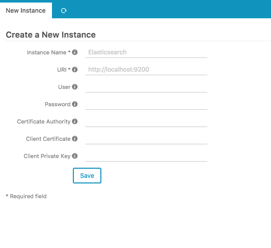
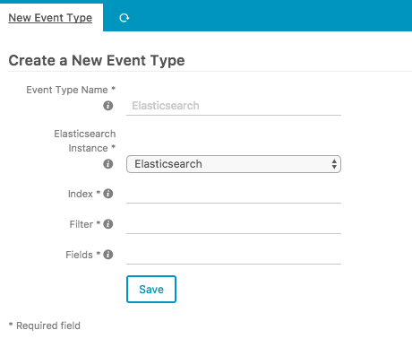

# Configuration

This chapter will give you the very basics to get the Splunk module for Icinga Web 2 up and running. 

## Splunk Instances

The first step to take here is to define how to connect to your Splunk instances. Using the web interface is
the preferred method of configuration. Please access `Configuration -> Modules -> splunk -> Instances` in order
to set up a new Splunk instance.

| Option                | Required | Description                         |
| --------------------- | -------- | ----------------------------------- |
| Name                  | **yes**  | Name of the Splunk instance. |
| URI                   | **yes**  | URI of the Splunk instance.  |
| User                  | no       | Username                            |
| Password              | no       | Password                            |
| Certificate Authority | no       | The path of the file containing one or more certificates to verify the peer with or the path to the directory that holds multiple CA certificates. |
| Client Certificate    | no       | The path of the client certificate. |
| Client Private Key    | no       | The path of the client private key. |

## Event Types

Event types define how to access data in your Splunk instances. Again, please use the web interface for
configuration and access `Configuration -> Modules -> splunk -> Event Types`.

| Option                | Required | Description                                     |
| --------------------- | -------- | ----------------------------------------------- |
| Name                  | **yes**  | Name of the event type.                         |
| Instance              | **yes**  | Splunk instance to connect to.           |
| Index                 | **yes**  | Splunk index pattern, e.g. `access-*`. |
| Filter                | **yes**  | Splunk filter in the Icinga Web 2 URL filter format. Host macros are evaluated if you encapsulate them in curly braces, e.g. `host={host.name}&location={_host_location}`. |
| Fields                | **yes**  | Comma-separated list of field names to display. One or more wildcard asterisk (`*`) patterns are also accepted. Note that the `@timestamp` field is always respected. | 

### Examples

Some examples that may help you to create your own Event Types. You can either use the webinterface or copy the
configuration directly into `/etc/icingaweb2/modules/splunk/eventtypes.ini`.

